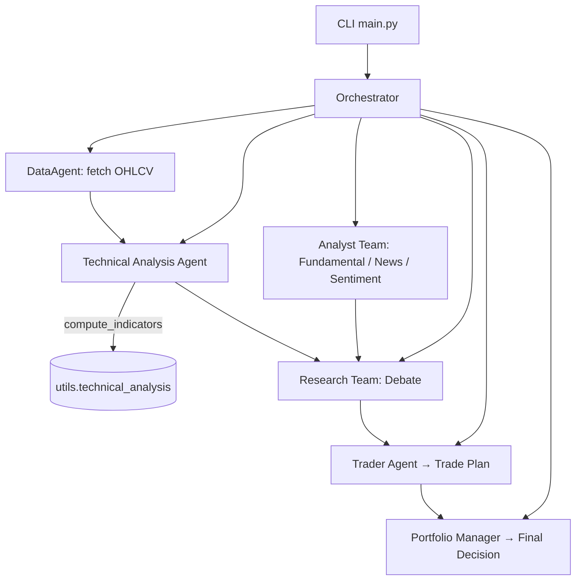

# 🌟 vn-stock-ai-hedgefund - Your AI Partner for Stock Decisions

## 📥 Download Now

## 🚀 Getting Started
This guide helps you download and run the vn-stock-ai-hedgefund application. Follow these steps to set it up easily.

## 🛠️ System Requirements
- Operating System: Windows 10 or later / macOS Mojave or later / Linux (Ubuntu 18.04 or later)
- Memory: 4 GB RAM minimum
- Disk Space: 200 MB available space
- Internet Connection: Required for data fetching

## 📂 Download & Install
1. **Visit the Releases page**: Go to the [Releases page](https://github.com/dhnlc/vn-stock-ai-hedgefund/releases).
2. **Choose the latest version**: Look for the most recent release and click on it.
3. **Download the application**: Find the download link for your operating system. Click to download the file.
4. **Install the application**:
   - **Windows**: Run the `.exe` file and follow the prompts.
   - **macOS**: Open the `.dmg` file, drag the application to the Applications folder.
   - **Linux**: Use the package manager or run the executable via terminal.

## 🔍 Overview of Functionality
vn-stock-ai-hedgefund acts as your finance agent, helping you monitor and make decisions on Vietnamese equities. Here's how it works:

- **Data Fetching**: The application gathers historical Open, High, Low, Close, and Volume (OHLCV) data for stocks you are interested in.
- **Analysis Tools**: It performs technical analysis to help you understand market trends.
- **Research Insight**: The app provides insights by analyzing news, sentiment, and fundamental data.
- **Trade Planning**: After all the research and analysis, it synthesizes a trade plan for you.

## 📊 Architecture
The application uses a multi-agent structure:

## ✏️ Features
- **User-Friendly Interface**: Designed to guide you through the analysis and trading process.
- **Data Visualization**: Graphical displays of data trends to aid understanding.
- **Customization**: Ability to modify parameters for a personalized experience.

## ⚙️ Usage Instructions
1. **Open the application**: Launch the vn-stock-ai-hedgefund application from your desktop or applications folder.
2. **Select stocks**: Enter the stock symbols you want to analyze.
3. **Review data**: Examine the fetched OHLCV data and other analysis results.
4. **Generate trade plans**: View suggested trade plans based on the analysis conducted.

## 💡 Tips for Successful Use
- **Stay Updated**: Regularly check for updates on the Releases page to access new features and improvements.
- **Experiment with Settings**: Try different stock symbols and parameters to see how they affect outcomes.
- **Consult Additional Resources**: Refer to the linked [TradingAgents document](https://github.com/TauricResearch/TradingAgents/blob/main/README.md) for a deeper understanding of multi-agent systems.

## 📌 Troubleshooting
If you encounter issues, consider the following:

- **Error Messages**: Read error messages carefully; they can offer clues on how to fix the issue.
- **Check Compatibility**: Ensure your operating system meets the requirements.
- **Reinstall the Application**: If problems persist, try uninstalling and then reinstalling the application.

## 🙋 Frequently Asked Questions

**Q: What types of stocks can I analyze?**
A: You can analyze any Vietnamese equities that have OHLCV data available.

**Q: Is there a mobile version?**
A: Currently, the application is only available for desktop use.

**Q: How often is data updated?**
A: The dataset is refreshed daily to provide the latest information.

## 📞 Support
For additional support, please file an issue in the GitHub repository or refer to the community discussions.

## 📢 Acknowledgments
This project is inspired by the research and methods from TradingAgents by TauricResearch. You can find more concepts by reviewing their documentation.

