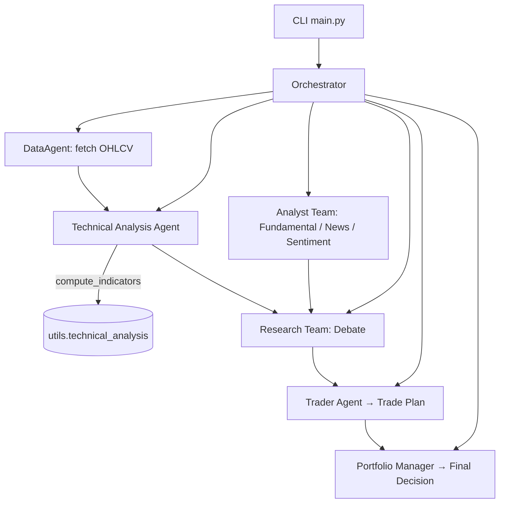

# Finance Agent

Multi-agent research and trading decision pipeline for Vietnamese equities, orchestrated by Agno. It fetches historical OHLCV data, performs technical analysis, runs multi-perspective research, and synthesizes a trade plan with risk-aware final approval.

This project draws inspiration from the multi-agent coordination patterns described in TradingAgents by TauricResearch. See the reference README for conceptual background: [TradingAgents](https://github.com/TauricResearch/TradingAgents/blob/main/README.md).

---

## Architecture



Key ideas adapted from coordinated multi-agent pipelines as introduced in TradingAgents [link](https://github.com/TauricResearch/TradingAgents/blob/main/README.md).

## Features

- **DataAgent**: Retrieves OHLCV for VN equities from `yfinance` or `vnstock`.
- **Analyst Team**: LLM-driven fundamental, news, and sentiment analysis.
- **Technical Analysis Agent**: Computes indicators (SMA/EMA/RSI/MACD/BB) and produces a concise TA report.
- **Research Team**: Debates bullish and bearish theses.
- **Trader + PM**: Synthesizes a clear plan (entry/stop/target) and issues a final PM approval decision.

---

## Setup

### Prerequisites

- Python 3.11+
- `uv` package manager
- At least one LLM provider API key (OpenAI, Anthropic, or Groq)

### Installation

Using uv:

```bash
curl -fsSL https://astral.sh/uv/install.sh | sh  # optional installer
cd finance_agent_new
uv sync
```

### Environment configuration

Configure provider and keys via environment variables or a `.env` file (parsed by `pydantic-settings`).

```
# LLM model provider and model id
AGNO_MODEL_PROVIDER=openai        # openai | anthropic | groq
AGNO_MODEL_ID=gpt-4o-mini         # optional, will use sensible default per provider

# API keys (set the one matching the provider)
OPENAI_API_KEY=sk-...
ANTHROPIC_API_KEY=...
GROQ_API_KEY=...

# Data source selection
DATA_SOURCE=yfinance              # yfinance | vnstock
VNSTOCK_SOURCE=VCI                # VCI | TCBS | MSN (when DATA_SOURCE=vnstock)
```

---

## Usage

From the project root:

```bash
uv run python -m finance_agent_new.main VNM.VN --start 2023-01-01 --end 2023-12-31
```

CLI options:

```
usage: main.py symbol [--start YYYY-MM-DD] [--end YYYY-MM-DD] [--source yfinance|vnstock]
```

Using `vnstock` as the data source requires explicit start and end dates:

```bash
uv run python -m finance_agent_new.main VNM.VN --source vnstock --start 2023-01-01 --end 2023-12-31
```

---

## Project Structure

```text
finance_agent_new/
├── agents/
│   ├── analysts/
│   │   ├── fundamental_analyst.py
│   │   ├── news_analyst.py
│   │   ├── sentiment_analyst.py
│   │   └── technical_analyst.py
│   ├── researchers/
│   │   └── research_team.py
│   ├── trading/
│   │   ├── decision_team.py
│   │   ├── portfolio_manager.py
│   │   └── trader.py
│   ├── analysis_agent.py
│   ├── data_agent.py
│   ├── orchestration.py
│   └── strategy_agent.py
├── config/
│   └── settings.py
├── utils/
│   ├── logging.py
│   ├── model_factory.py
│   └── technical_analysis.py
├── main.py
├── pyproject.toml
└── README.md
```

---

## Configuration and Models

By default, `utils.model_factory.build_default_model()` selects a provider and model ID from environment variables. Supported providers:

- `openai` → default `gpt-4o-mini`
- `anthropic` → default `claude-3-5-sonnet-20240620`
- `groq` → default `llama-3.1-70b-versatile`

See `config/settings.py` and `utils/model_factory.py` for details.

---

## Notes

- This codebase is intended for research and educational purposes. It is not financial advice.
- The orchestration uses a single-line spinner per step (no multi-task progress bar) to reflect unknown step durations.

---

## Acknowledgements

- Concepts adapted from TradingAgents by TauricResearch: [link](https://github.com/TauricResearch/TradingAgents/blob/main/README.md)

## License

MIT
